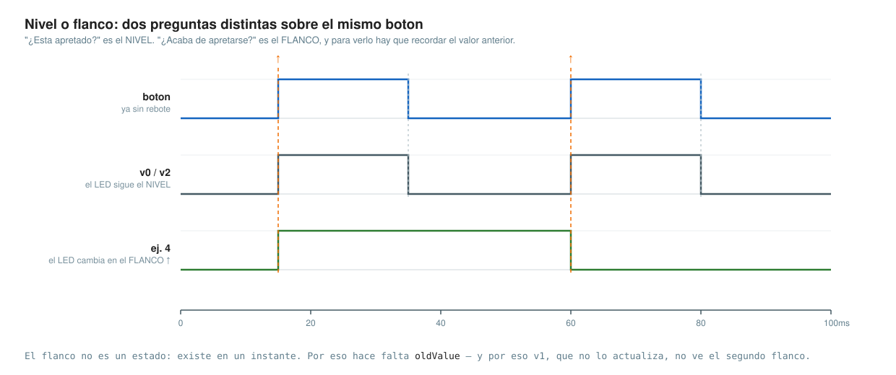
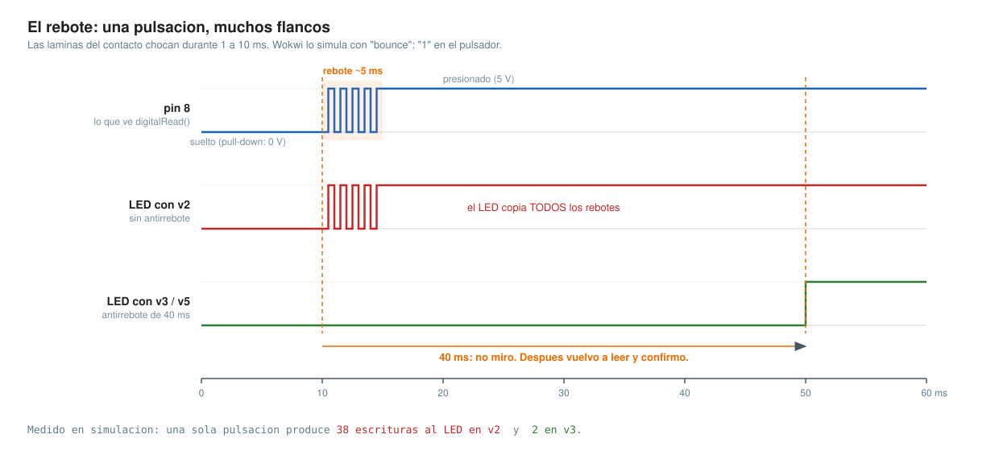
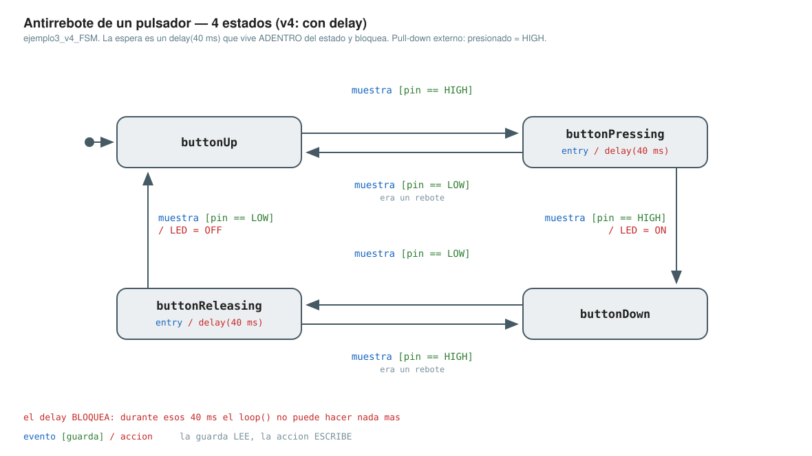
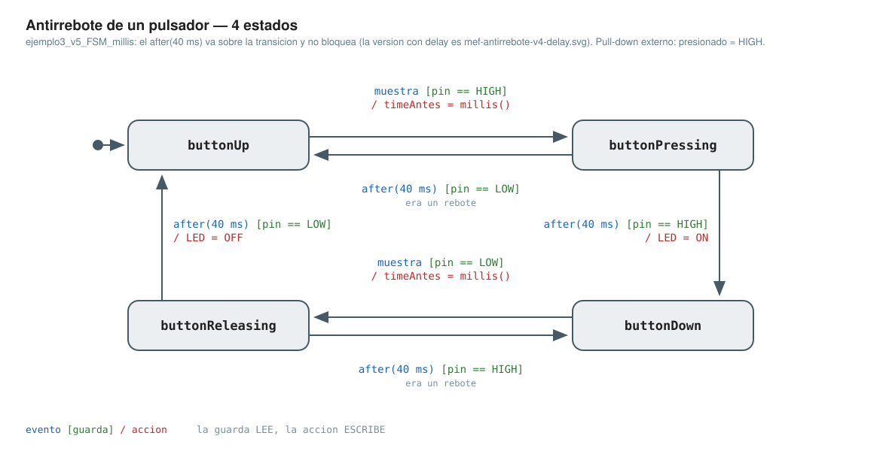
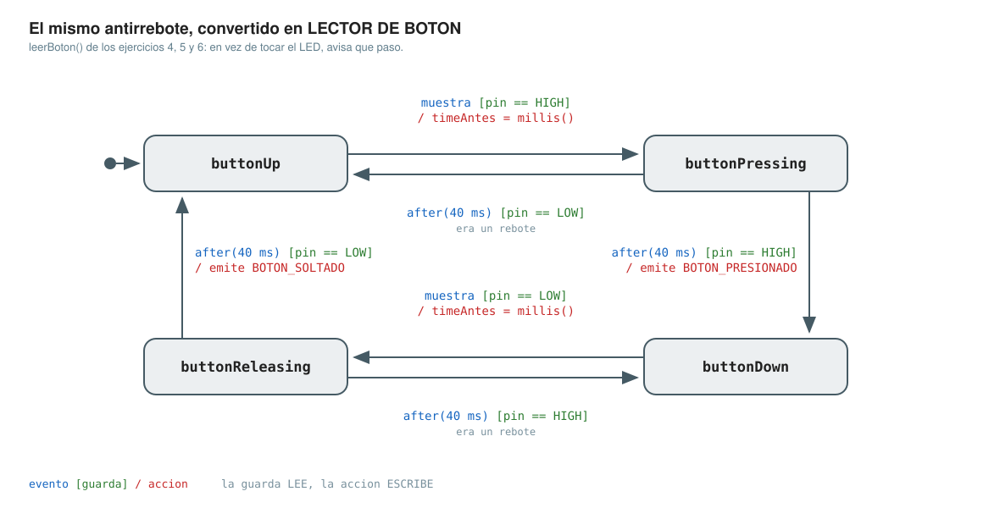
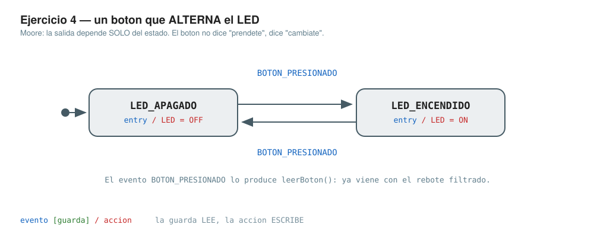
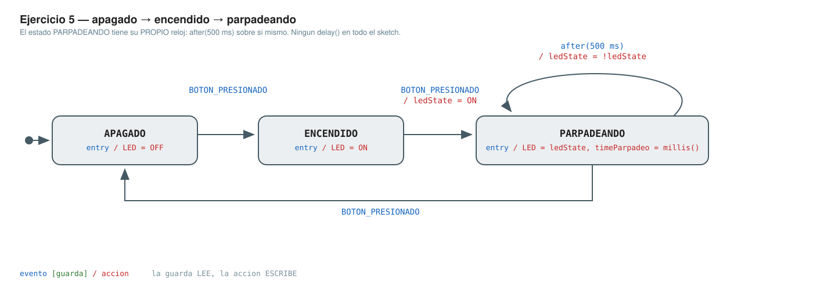
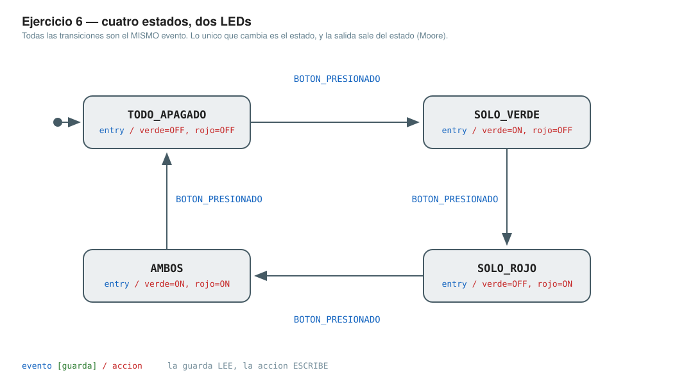

# Clase 14

**Tema:** Entradas digitales en el microcontrolador y **cómo manejar los tiempos** sin bloquear el programa. Leer un botón (nivel vs **flanco**), el **rebote** del contacto y cómo filtrarlo, `delay()` vs `millis()`, dos temporizadores conviviendo en un solo `loop()`, y la separación entre el **driver** que lee el hardware y la **aplicación** que decide qué hacer. Todo sobre Arduino Mega 2560 simulado en **Wokwi**, a nivel de la API del core de Arduino (`pinMode`, `digitalWrite`, `digitalRead`, `delay`, `millis`).

## De dónde sale este código

> Este material **no es una colección de soluciones sueltas**: es lo que se construyó en la **clase práctica** al resolver, en vivo, los seis ejercicios propuestos al cierre de la clase 13. Conviene tener en cuenta cuatro cosas al leerlo.

1. **Cada paso tenía un porqué.** El ejercicio 3 (un LED que sigue a un botón) está resuelto **siete veces** (`v0` … `v6`). No son alternativas: es una **escalera**. Cada versión resuelve el problema que dejó abierto la anterior y **falla por una razón nueva**, y esa razón es lo que se quería mostrar. Si ven una versión sola, sin la anterior, pierde el sentido.

2. **La máquina de estados del antirrebote no es la única forma de hacerlo**, ni la más corta. En la industria el antirrebote no bloqueante se resuelve en unas cinco líneas, sin `enum` ni `switch` (se guarda la última lectura cruda y se rearma un reloj en cada cambio); también hay librerías que lo hacen, soluciones en hardware (RC + Schmitt trigger) y variantes con interrupciones. La usamos como **MEF** para **practicar lo nuestro, en el formato que ya vimos**: `typedef enum` + `switch`, la plantilla `formato_FSM.c` y la notación `evento [guarda] / acción` de la [clase 11](../../2026-1C/clase-11/). Es la primera vez que esa máquina toca hardware.

3. **Hay otras formas de resolver cada uno de los ejercicios.** Elegimos una y la sostuvimos: la misma máquina del ejercicio 3 se reusa **sin tocarla** en los ejercicios 4, 5 y 6. Eso es una decisión de **coherencia didáctica**, no una afirmación de que sea la mejor solución posible para cada caso.

4. **La idea de fondo fue presentar cómo se manejan «los tiempos».** En el micro hay **un solo hilo de ejecución** (`loop()`) y no hay sistema operativo que atienda el botón por nosotros. `delay()` **consume** tiempo; `millis()` lo **mira**. Esa diferencia es la que separa un programa que funciona de uno que se queda sordo mientras espera, y es el hilo que atraviesa los seis ejercicios.

## Cómo correrlos

Cada carpeta es un proyecto de Wokwi completo: `sketch.ino` (el código), `diagram.json` (el circuito) y `wokwi-project.txt` (el link al proyecto original).

* **En Wokwi:** https://wokwi.com → *New Project* → *Arduino Mega* → pegar el contenido de `sketch.ino` en la pestaña del código y el de `diagram.json` en la pestaña `diagram.json`. (Los pulsadores tienen `"bounce": "1"` para que el rebote **se vea**, como en la placa real.)
* **En la placa real** (Mega 2560, desde la terminal): arduino-cli exige que el archivo se llame como la carpeta, así que primero `mv sketch.ino <nombre-de-la-carpeta>.ino` y después, parados adentro de la carpeta:
  ```bash
  arduino-cli compile --fqbn arduino:avr:mega .
  arduino-cli upload  --fqbn arduino:avr:mega -p /dev/ttyUSB0 .
  ```

**Circuito de los ejercicios 3 a 6:** botón entre 5 V y el **pin 8** con una **resistencia de pull-down de 1 kΩ** a GND (lógica directa: presionado = `HIGH`); LED en el **pin 9** con 1 kΩ en serie. El ejercicio 6 agrega un segundo LED en el **pin 10**. La versión `v6` cambia a **pin 21 + `INPUT_PULLUP`** (sin resistencia externa, lógica invertida).

## Ejercicios 1 y 2 — de dónde arrancamos

* **[ej1](ej1/)** — *Parpadear el LED de la placa.* `pinMode` + `digitalWrite` + `delay`. Se usa `LED_BUILTIN` en vez del `13`: es un `#define` del core (vale 13 en el Mega) y hace que el mismo sketch ande en otra placa. Ese LED tiene un buffer en el medio, así que no necesita resistencia.
  Probar: el LED `L` de la placa parpadea a 1 Hz.

* **[ej2](ej2/)** — *Parpadear un LED en el pin 12.* Mismo programa; cambia el número de pin y aparece `const uint8_t`. `uint8_t` es de **C estándar** (`<stdint.h>`), no de Arduino. Un LED no limita su corriente: la fija la **resistencia en serie**, `I = (5 V − 2 V) / 1 kΩ = 3 mA`. Un pin del ATmega2560 garantiza nivel lógico hasta **20 mA** y se rompe a partir de **40 mA**.
  Probar: mismo parpadeo, ahora en el LED externo.

## Ejercicio 3 — la escalera

*Encender un LED mientras se mantiene presionado un botón. Apagar al soltar. Con pull-down y antirrebote.*

| Versión | Agrega | Y falla por… |
|---|---|---|
| [`v0`](ej3_v0/) | lectura por **nivel**: `digitalRead` + `if/else` | no sirve para el ej. 4, donde hace falta el **instante** del cambio y no el nivel |
| [`v1`](ej3_v1/) | `oldValue` para detectar el **flanco**… sin actualizarla (**bug a propósito**) | prende y **no apaga nunca** |
| [`v2`](ej3_v2/) | `oldValue = newValue` — el flanco, bien | el **rebote** del contacto |
| [`v3`](ej3_v3/) | antirrebote: `delay(40)` **y volver a leer** | `delay()` **bloquea** el `loop()` |
| [`v4`](ej3_v4_FSM/) | el antirrebote como **MEF** de 4 estados | el `delay(40)` sigue adentro |
| [`v5`](ej3_v5_FSM_millis/) | la misma MEF con `millis()` — **no bloqueante** | — **← resolución del ejercicio 3** |
| [`v6`](ej3_v6_pin21_pullup/) | pin 21 + `INPUT_PULLUP`, se invierten los `HIGH`/`LOW` | — (puente con la clase de interrupciones) |

**`v0` funciona y resuelve el enunciado.** Todo lo que sigue no es porque falle: es porque el ejercicio 4 va a pedir «al presionar», y para eso hace falta saber **cuándo cambió** el botón, no cómo está. Ver un cambio exige **recordar el valor anterior** (`oldValue`, global: lo que se declara dentro de `loop()` no sobrevive entre vueltas).



**`v1` está rota a propósito.** Antes de correrla, predecí qué hace. `oldValue` nunca se actualiza, así que al soltar el botón `LOW == oldValue` y no entra al `if`: el LED queda prendido. Una sola línea que falta produce una falla total. **`v2`** la agrega y se comporta igual que `v0`; la diferencia no se ve, se razona: `v0` escribe el pin en cada vuelta, `v2` sólo cuando algo cambió.

**El rebote.** Un pulsador son dos láminas que chocan: entre 1 y 10 ms de flancos falsos por pulsación, y a 16 MHz el micro los ve todos. Medido en simulación con 5 ms de rebote: **una pulsación produce 38 escrituras al LED en `v2`, y 2 en `v3`.**



**El antirrebote son dos mitades: esperar y volver a leer.** Un `delay(40)` sin la segunda lectura no filtra nada, sólo llega tarde. ¿Por qué 40 ms? Más que el rebote (1-10 ms), menos que un dedo humano (~100 ms). El costo, y es el tema de toda la clase: durante esos 40 ms el micro **no puede hacer nada más**.

**`v4` ordena, no destraba.** El «en qué paso voy» deja de estar escondido en `if` anidados y pasa a ser una variable con nombre. Los cuatro estados describen al **botón**, no al voltaje: `buttonUp` · `buttonPressing` · `buttonDown` · `buttonReleasing`. Por eso sobreviven a `v6`, donde todos los `HIGH`/`LOW` se invierten y la máquina no se toca. Los rebotes dejan de ser un caso raro: son **la transición que vuelve al estado anterior**. ⚠️ `NextState` guarda el estado **actual** (el `switch` despacha sobre ella): el nombre viene de la plantilla de la clase 11.



**`v5` es la resolución.** Misma máquina, mismos estados; lo único que cambia es **cómo se espera**: en vez de frenar el programa, se anota cuándo empezó (`timeAntes = millis()`) y en cada vuelta se pregunta si ya pasó. En el diagrama la espera se muda de adentro de la caja (`entry / delay(40 ms)`) a la flecha (`after(40 ms)`).



* **Por qué la resta y no la suma:** `(uint32_t)(millis() - timeAntes) >= antireboteMS` funciona siempre; `millis() >= timeAntes + 40` se rompe cuando `millis()` desborda (a los ~49,7 días). No es un truco de Arduino: la aritmética sin signo en C está definida módulo 2³² (C §6.2.5). Es de los pocos lugares donde el desbordamiento es una herramienta.
* `antireboteMS` pasa a `uint32_t` para comparar del mismo tipo (en AVR `int` son **16 bits**). `timeAntes` **no puede ser `const`**: es estado, lo escribe una acción.

**`v6` (opcional).** El chip trae **pull-up interno** (20-50 kΩ) y **no** trae pull-down. `INPUT_PULLUP` no es «otra forma de conectar el botón»: es una resistencia que en vez de comprarla, se escribe. El pin 21 es uno de los de interrupción externa del Mega: es el circuito con el que arranca la clase que viene.

Probar en Wokwi: `v1` (predecir antes de correrla), `v2` con el rebote activo (mirar cuántas veces cambia el LED al presionar una vez), `v3` (lo mismo, ahora limpio), `v5` (igual que `v3`, pero el `loop()` nunca se detiene).

## Ejercicios 4, 5 y 6 — el mismo `leerBoton()`

**El refactor que vale la clase.** La MEF de `v5` se muda adentro de una función, `leerBoton()`, que devuelve un evento: `SIN_EVENTO`, `BOTON_PRESIONADO` o `BOTON_SOLTADO`. El programa queda partido en dos piezas: un **driver** que sabe de electrónica y no sabe para qué sirve, y una **aplicación** (`loop()`) que sabe para qué sirve y no sabe de electrónica. El contrato entre las dos es el `enum EVENTOS`.



`leerBoton()` es **idéntica, byte por byte**, en los tres ejercicios. Tres productos distintos sobre el mismo driver sin tocarle una coma: ésa es la prueba de que la separación era real.

* **[ej4](ej4/)** — *Encender al presionar, apagar al volver a presionar.* Acá la clase cambia de tema: hasta ahora la salida era función de la **entrada**; ahora es función del **estado** (Moore). El botón ya no dice «prendete»: dice «cambiate». La máquina de aplicación es un flip-flop T y cabe en un `!`: `ledState = !ledState;` (`!` lógico, no `~`). `BOTON_SOLTADO` no lo usa ningún ejercicio y no sobra: un driver reporta los dos flancos y deja que la aplicación elija.
  Probar: tres pulsaciones → prende, apaga, prende. Después sacá el antirrebote con el rebote activo: el LED es una lotería. En el ejercicio 3 el rebote ensuciaba; acá **rompe**.

  

* **[ej5](ej5/)** — *Apagado → encendido → parpadeando → apagado.* **El ejercicio que rompe `delay()`.** El intento natural es `digitalWrite(HIGH); delay(500); digitalWrite(LOW); delay(500);` dentro del estado `PARPADEANDO`: el LED parpadea ✅ y el botón **no responde** ❌, porque `loop()` da una vuelta por segundo y `leerBoton()` sólo mira el pin cuando la llamamos. **Con polling, un evento más corto que la vuelta del `loop()` es invisible.** La solución es la misma idea de `v5` aplicada dos veces: **dos relojes independientes**, `timeAntes` (40 ms, dentro del driver) y `timeParpadeo` (500 ms, en la aplicación). No se pisan, y un tercero costaría una variable más. Ningún `delay()` en todo el sketch: eso se llama **superloop cooperativo**.
  Probar: presionar tres veces con la tercera **durante** el parpadeo: se atiende igual.

  

* **[ej6](ej6/)** — *Verde → rojo → ambos → todo apagado, y vuelve a empezar.* Ninguna función nueva, ningún concepto nuevo: es el ejercicio 4 con cuatro estados en vez de dos y dos salidas en vez de una. **Moore puro, y se ve en el código:** las transiciones **no tocan los LEDs**, sólo cambian de estado; quien enciende y apaga es `actualizarLeds()`, que mira el estado y nada más (`salida = g(estado)`). Agregar un estado cuesta un `case`. *(El enunciado original dice «al presionar un led»: es errata, va «un botón».)*
  Probar: cinco pulsaciones recorren el ciclo completo y vuelven a verde.

  

## Lo que resolvimos

* Leer una entrada digital sin que el pin quede flotando (pull-down, pull-up, `INPUT_PULLUP`).
* Distinguir **nivel** de **flanco**, y recordar el valor anterior para poder verlo.
* Filtrar el rebote: esperar **y** confirmar.
* Modelar el botón como MEF con la notación de la cátedra.
* Esperar **sin bloquear** con `millis()`, y tener varios relojes a la vez.
* Separar el **driver** de la **aplicación**.

## Lo que viene

Seguimos **preguntando** todo el tiempo si el botón cambió: eso es *polling*. La clase que viene el micro nos avisa: **interrupciones**.
