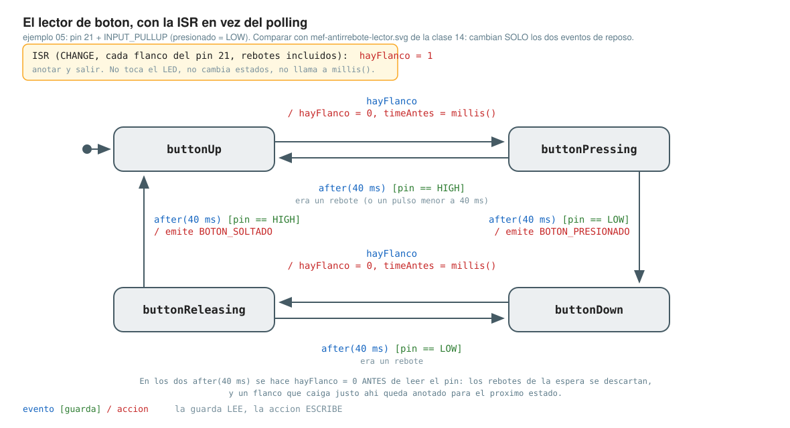

# Clase 15

**Tema:** **Interrupciones de hardware.** Qué pines pueden interrumpir (`digitalPinToInterrupt`), cómo se escribe una ISR, `volatile` y **sección crítica**, y el antirrebote de la clase 14 con interrupción. Arduino Mega 2560 en **Wokwi**.

Punto de partida: [`v6`](../clase-14/ej3_v6_pin21_pullup/) de la clase 14, botón en el **pin 21** con `INPUT_PULLUP`.

## Cómo correrlos

Cada carpeta es un proyecto de Wokwi: `sketch.ino` (código) y `diagram.json` (circuito).

* **En Wokwi:** https://wokwi.com → *New Project* → *Arduino Mega* → pegar cada archivo en su pestaña.
* **En la placa real:** renombrar `sketch.ino` a `<carpeta>.ino` y, adentro de la carpeta:
  ```bash
  arduino-cli compile --fqbn arduino:avr:mega .
  arduino-cli upload  --fqbn arduino:avr:mega -p /dev/ttyUSB0 .
  ```

| Ejemplos | Circuito |
|---|---|
| `ej00` | sólo la placa |
| `ej02`, `ej03`, `ej04` | LED en el **pin 9** con 1 kΩ y **un cable del pin 4 al 21** (el sketch genera la señal) |
| `ej05` | **botón del pin 21 a GND, sin resistencia** (`INPUT_PULLUP`); LED en el 9 con 1 kΩ |

> ⚠️ **Si venís del circuito de la clase 14 (pin 8 + pull-down):** mover el botón al **pin 21**, quitar la resistencia y llevar la otra pata a GND. `attachInterrupt()` sobre un pin que no es de interrupción **no da error: no hace nada**.

## ej00 — [¿qué pines pueden interrumpir?](ej00_digitalPinToInterrupt/)

Lista los pines del Mega con interrupción externa. Probar: monitor serie a **115200**.

```
Pin digital 2 -> interrupcion #0      Pin digital 19 -> interrupcion #4
Pin digital 3 -> interrupcion #1      Pin digital 20 -> interrupcion #3
Pin digital 18 -> interrupcion #5     Pin digital 21 -> interrupcion #2
```

El número de interrupción no coincide con el del pin ni con el `INTn` del chip: **nunca se escribe a mano**, siempre `digitalPinToInterrupt(pin)`.

## ej02 — [la primera ISR](ej02_isr_enciende/)

`attachInterrupt( digitalPinToInterrupt(pin), funcion, RISING )` y la **ISR**: una función sin parámetros ni retorno que nadie llama desde el código.

Probar: a los 2 s el LED enciende, **mientras el `loop()` está en `delay(2000)`**. A la ISR la llama el hardware.

## ej03 — [una cuadrada de 5 Hz y una ISR que invierte](ej03_isr_toggle_5hz/)

El pin 4 genera una onda cuadrada con `millis()`; la ISR invierte el LED en cada flanco ascendente.

Probar: el LED parpadea a **2,5 Hz**. Con `FALLING`, igual; con `CHANGE`, 5 Hz.

* `ledState` **no** lleva `volatile`: sólo la usa la ISR.
* ⛔ **No** probar el modo `LOW`: la ISR reentra sin parar y el `loop()` no vuelve a correr.

## ej04 — [contar entradas y avisar cada 500 · sección crítica](ej04_isr_contador_serial/)

**La ISR no imprime: cuenta.** El `loop()` imprime. `contador` es `volatile uint16_t`: la primera variable **compartida** entre la ISR y el `loop()`.

Probar: monitor serie, un aviso por segundo.

* **Sección crítica:** `contador` ocupa 2 bytes y el `loop()` los lee en dos instrucciones. Si la ISR entra en el medio, el valor leído es incorrecto. `noInterrupts()` / `interrupts()` protegen la lectura.
* **`volatile` no hace atómica a la variable:** sólo obliga a leerla de memoria cada vez.
* `Serial.print()` adentro de una ISR **la bloquea** (~2 ms por aviso).

## ej05 — [el ejercicio 5 de la clase pasada, con interrupción](ej05_boton_isr_parpadeo/)

*Encender al presionar. Parpadear al volver a presionar. Apagar al volver a presionar.* Mismo enunciado que el [ejercicio 5 de la clase 14](../clase-14/ej5/): la aplicación no cambia, sólo `leerBoton()` y la ISR.

Probar: se comporta **igual** que la versión por polling.



* **La interrupción no filtra el rebote:** con `CHANGE` la ISR entra **114 veces en tres pulsaciones**; la máquina de estados ve **3** eventos.
* **Adentro de una ISR no hay `delay()`:** depende de la interrupción del Timer 0, que no corre mientras se ejecuta otra ISR.
* **El flag `volatile uint8_t hayFlanco`:** la ISR lo pone en 1 y sale; `leerBoton()` lo consume y a los 40 ms **confirma leyendo el pin**. Es un byte: no necesita sección crítica.
* **`hayFlanco = 0` en cada `case`:** primero limpiar el flag, después leer el pin. Al revés se puede perder un flanco.
* `CHANGE` y no `FALLING`: hacen falta los dos flancos. `pinMode(..., INPUT_PULLUP)` va **antes** de `attachInterrupt`.
* Con `delay(200)` al final del `loop()`: **la interrupción no arregla un `loop()` lento, evita que el evento se pierda.**

## Errores frecuentes

* `attachInterrupt` sobre un pin que no es de interrupción → no hace nada, sin aviso.
* Escribir el número de interrupción a mano → en el Mega, la 0 es el pin **2**.
* `delay()` o `Serial.print()` adentro de la ISR.
* Olvidarse `volatile` en la variable compartida.
* Creer que `volatile` alcanza para 2 o 4 bytes → hace falta la sección crítica.
* `attachInterrupt` antes de `pinMode(..., INPUT_PULLUP)` → un disparo espurio al arrancar.
* Leer el pin y **después** limpiar el flag → se puede perder un flanco.
